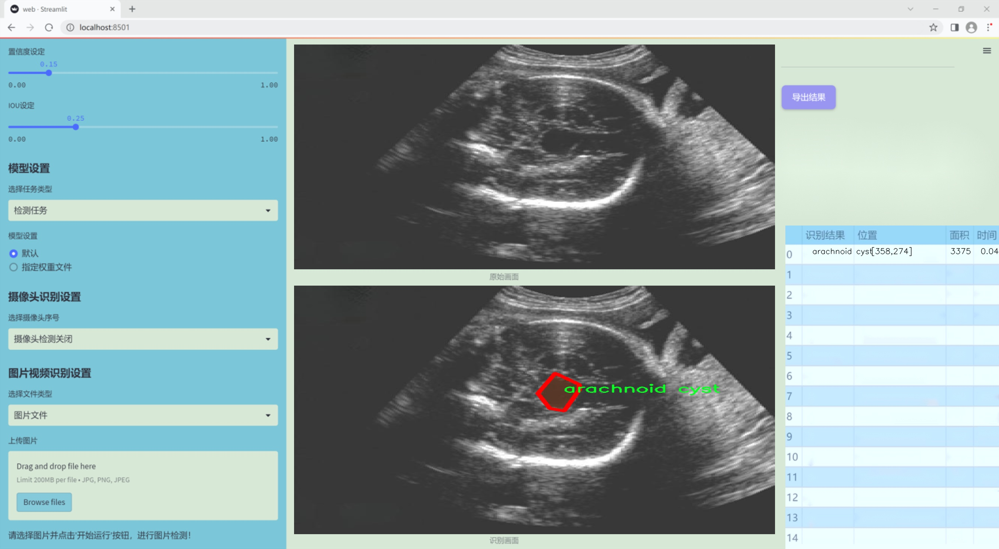
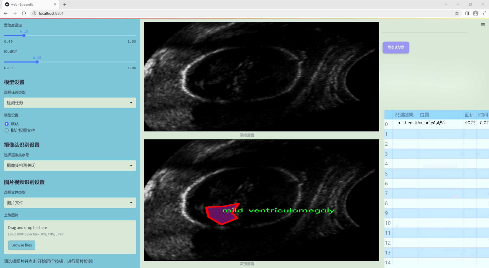
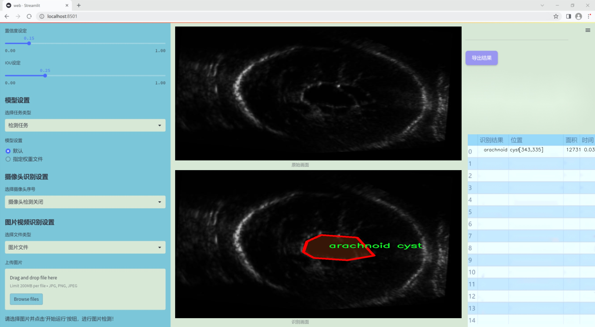
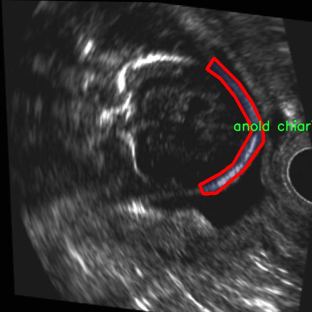
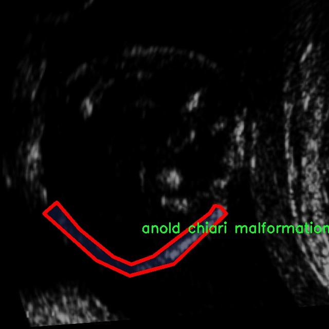
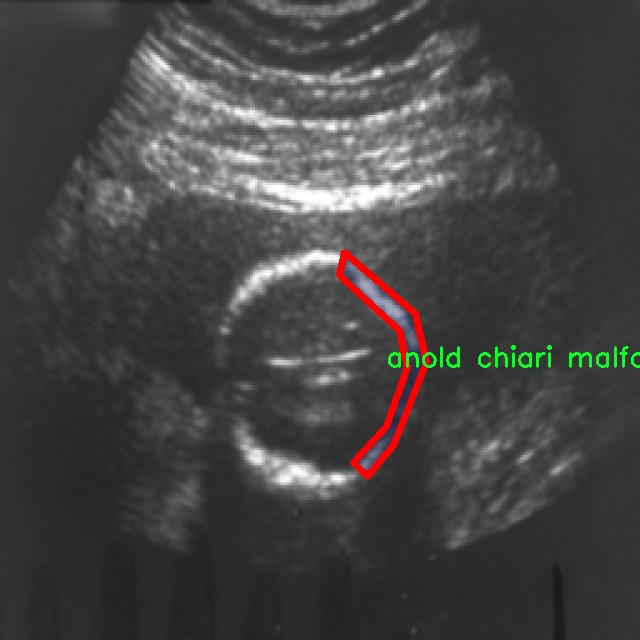
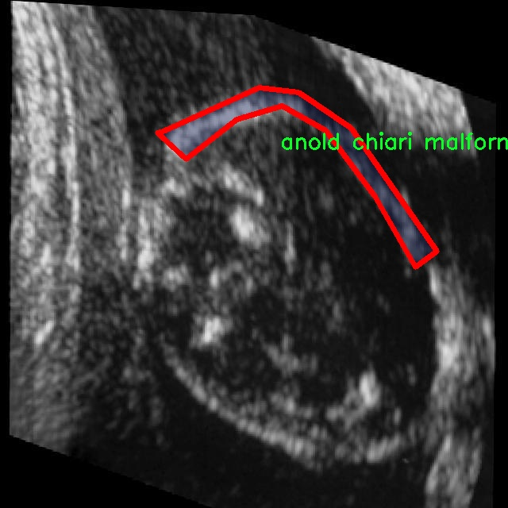
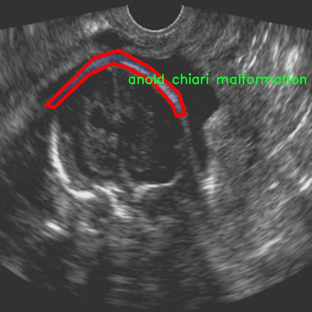

### 1.背景意义

研究背景与意义

胎儿脑部异常的早期检测对于降低新生儿死亡率和改善生存质量具有重要意义。随着医学影像技术的不断发展，超声成像已成为产前筛查中最常用的方法之一。然而，传统的人工分析方法不仅耗时且容易受到主观因素的影响，导致漏诊或误诊的风险。因此，基于计算机视觉的自动化检测系统应运而生，能够有效提高胎儿脑部异常的识别率和准确性。

在众多计算机视觉算法中，YOLO（You Only Look Once）系列模型因其快速和高效的特性而备受关注。YOLOv11作为该系列的最新版本，进一步优化了目标检测的性能，尤其在处理复杂背景和小目标时表现出色。通过对YOLOv11进行改进，结合胎儿脑部异常的特定特征，我们可以构建一个高效的检测系统，帮助医生更准确地识别和分类不同类型的脑部异常。

本研究所使用的数据集包含1400幅图像，涵盖14种不同的胎儿脑部异常类型，包括小脑发育不良、脑积水、脑膜囊肿等。这些异常的早期识别对于制定有效的干预措施至关重要。通过对这些图像进行实例分割和检测，我们能够训练出一个具有较高准确率的模型，从而在临床实践中提供有力支持。

此外，随着深度学习技术的不断进步，模型的训练和优化也变得更加高效。通过引入主动学习等先进技术，系统能够在使用过程中不断更新和改进，提升检测的准确性和鲁棒性。这不仅有助于提高胎儿脑部异常的检测率，也为未来相关研究提供了新的思路和方法。总之，基于改进YOLOv11的胎儿脑部异常检测系统的研究，不仅具有重要的学术价值，也为临床应用提供了切实可行的解决方案。

### 2.视频效果

[2.1 视频效果](https://www.bilibili.com/video/BV1KMkCY1Enu/)

### 3.图片效果







##### [项目涉及的源码数据来源链接](https://kdocs.cn/l/cszuIiCKVNis)**

注意：本项目提供训练的数据集和训练教程,由于版本持续更新,暂不提供权重文件（best.pt）,请按照6.训练教程进行训练后实现上图演示的效果。

### 4.数据集信息

##### 4.1 本项目数据集类别数＆类别名

nc: 14
names: ['anold chiari malformation', 'arachnoid cyst', 'cerebellah hypoplasia', 'cisterna magna', 'colphocephaly', 'encephalocele', 'holoprosencephaly', 'hydracenphaly', 'intracranial hemorrdge', 'intracranial tumor', 'mild ventriculomegaly', 'moderate ventriculomegaly', 'polencephaly', 'severe ventriculomegaly']


该项目为【图像分割】数据集，请在【训练教程和Web端加载模型教程（第三步）】这一步的时候按照【图像分割】部分的教程来训练

##### 4.2 本项目数据集信息介绍

本项目数据集信息介绍

本项目旨在改进YOLOv11模型，以实现胎儿脑部异常的高效检测与分割。为此，我们构建了一个专门的数据集，涵盖了14种不同的胎儿脑部异常类型，旨在为模型的训练提供丰富的样本和多样化的特征。数据集的类别包括：老年型小脑畸形、蛛网膜囊肿、小脑发育不良、脑池、脑室扩大、脑膨出、全脑发育不良、脑积水、颅内出血、颅内肿瘤、轻度脑室扩大、中度脑室扩大、多脑室畸形和重度脑室扩大。这些类别不仅反映了胎儿脑部的多样性和复杂性，也为临床诊断提供了重要的参考依据。

在数据集的构建过程中，我们特别注重样本的多样性和代表性，确保每种异常类型都有足够的样本量，以便模型能够学习到不同异常的特征。数据集中的图像均为高分辨率医学影像，经过专业医生的标注，确保标注的准确性和可靠性。此外，为了提高模型的泛化能力，我们还进行了数据增强处理，包括旋转、缩放、翻转等操作，以模拟不同的临床场景和拍摄条件。

通过使用该数据集，我们希望能够训练出一个能够准确识别和分割胎儿脑部异常的智能系统，进而为早期诊断和干预提供支持。这不仅有助于提高临床医生的工作效率，也为胎儿健康提供了更为科学的保障。随着技术的不断进步，我们期待这一系统能够在实际应用中发挥重要作用，推动胎儿医学的发展。











### 5.全套项目环境部署视频教程（零基础手把手教学）

[5.1 所需软件PyCharm和Anaconda安装教程（第一步）](https://www.bilibili.com/video/BV1BoC1YCEKi/?spm_id_from=333.999.0.0&vd_source=bc9aec86d164b67a7004b996143742dc)


[5.2 安装Python虚拟环境创建和依赖库安装视频教程（第二步）](https://www.bilibili.com/video/BV1ZoC1YCEBw?spm_id_from=333.788.videopod.sections&vd_source=bc9aec86d164b67a7004b996143742dc)

### 6.改进YOLOv11训练教程和Web_UI前端加载模型教程（零基础手把手教学）

[6.1 改进YOLOv11训练教程和Web_UI前端加载模型教程（第三步）](https://www.bilibili.com/video/BV1BoC1YCEhR?spm_id_from=333.788.videopod.sections&vd_source=bc9aec86d164b67a7004b996143742dc)


按照上面的训练视频教程链接加载项目提供的数据集，运行train.py即可开始训练



     Epoch   gpu_mem       box       obj       cls    labels  img_size
     1/200     20.8G   0.01576   0.01955  0.007536        22      1280: 100%|██████████| 849/849 [14:42<00:00,  1.04s/it]
               Class     Images     Labels          P          R     mAP@.5 mAP@.5:.95: 100%|██████████| 213/213 [01:14<00:00,  2.87it/s]
                 all       3395      17314      0.994      0.957      0.0957      0.0843

     Epoch   gpu_mem       box       obj       cls    labels  img_size
     2/200     20.8G   0.01578   0.01923  0.007006        22      1280: 100%|██████████| 849/849 [14:44<00:00,  1.04s/it]
               Class     Images     Labels          P          R     mAP@.5 mAP@.5:.95: 100%|██████████| 213/213 [01:12<00:00,  2.95it/s]
                 all       3395      17314      0.996      0.956      0.0957      0.0845

     Epoch   gpu_mem       box       obj       cls    labels  img_size
     3/200     20.8G   0.01561    0.0191  0.006895        27      1280: 100%|██████████| 849/849 [10:56<00:00,  1.29it/s]
               Class     Images     Labels          P          R     mAP@.5 mAP@.5:.95: 100%|███████   | 187/213 [00:52<00:00,  4.04it/s]
                 all       3395      17314      0.996      0.957      0.0957      0.0845


###### [项目数据集下载链接](https://kdocs.cn/l/cszuIiCKVNis)

### 7.原始YOLOv11算法讲解


其实到了YOLOV11 基本创新点就不太多了，主要就是大家互相排列组合复用不同的网络模块、损失函数和样本匹配策略，需要注意YOLO V5、V8 V11
都是1个公司的，其余的个人建议看看V8的，剩下的了解就好。

V11支持多种视觉任务：物体检测、实例分割、图像分类、姿态估计和定向物体检测（OBB）。

##### YOLOv11
基本和YOLOV8同源，甚至git目前都是1个，部分代码注释还是YOLOV8的，所以建议先看我写的YOLOV8相关博客，对比YOLOV8主要涉及到：

*backbone 中的使用C2f模块 变为 c3k2 模块。

*backbone 中的最后一层（sppf层）后增加了C2PSA模块。

*head 解耦头中的分类检测头两个Conv 变为 DWConv。

整体技术而言：

*backbone 使用了C2K2模块+最后SPPF模块级联C2PSA模块；

*neck 使用PAN结构，并且里面也使用C3K2模块；

*head使用了anchor-free + Decoupled-head，其中回归头使用正常的卷积，分类头使用DWConv；

*损失函数使用了分类BCE、回归CIOU + VFL的组合；

*框匹配策略由静态匹配改为了Task-Aligned Assigner匹配方式；

*训练策略没有提及，其中YOLOV8可以参考如下最后 10 个 epoch 关闭 Mosaic 的操作、训练总 epoch 数从 300 提升到了 500。

##### 主要思路


配置文件：[ultralytics/ultralytics/cfg/models/11/yolo11.yaml at main ·
ultralytics/ultralytics ·
GitHub](https://github.com/ultralytics/ultralytics/blob/main/ultralytics/cfg/models/11/yolo11.yaml
"ultralytics/ultralytics/cfg/models/11/yolo11.yaml at main ·
ultralytics/ultralytics · GitHub")

解析函数：[ultralytics/ultralytics/nn/tasks.py at main · ultralytics/ultralytics ·
GitHub](https://github.com/ultralytics/ultralytics/blob/main/ultralytics/nn/tasks.py#L934
"ultralytics/ultralytics/nn/tasks.py at main · ultralytics/ultralytics ·
GitHub")


##### 具体细节

##### input

输入要求以及预处理，可选项比较多，可以参考这个配置文件：[ultralytics/ultralytics/cfg/default.yaml at main
· ultralytics/ultralytics ·
GitHub](https://github.com/ultralytics/ultralytics/blob/main/ultralytics/cfg/default.yaml
"ultralytics/ultralytics/cfg/default.yaml at main · ultralytics/ultralytics ·
GitHub") 的Hyperparameters 部分。

基础输入仍然为640*640。预处理就是熟悉的letterbox（根据参数配置可以为不同的缩放填充模式，主要用于resize到640）+
转换rgb、chw、int8(0-255)->float（0-1），注意没有归一化操作。需要注意的是作者实现的mosaic和网上看到的不同，对比如下图（左边网上版本，右边是YOLO的实现）。并且作者添加了在最后10轮关闭mosaic增强（YOLOV8开始支持，具体原因个人的经验如我的这篇文章：yolov5
mosaic相关，关闭参数在 Train settings 部分的close_mosaic 选项）


##### backbone

主干网络以及改进

这里不去特意强调对比YOLOv5、V8等等的改进，因为各个系列都在疯狂演进，个人认为没必要花费时间看差异，着重看看一些比较重要的模块即可。源代码：

大多数模块：[ultralytics/ultralytics/nn/modules/block.py at main ·
ultralytics/ultralytics ·
GitHub](https://github.com/ultralytics/ultralytics/blob/main/ultralytics/nn/modules/block.py
"ultralytics/ultralytics/nn/modules/block.py at main · ultralytics/ultralytics
· GitHub")

head 部分：[ultralytics/ultralytics/nn/modules/head.py at main ·
ultralytics/ultralytics ·
GitHub](https://github.com/ultralytics/ultralytics/blob/main/ultralytics/nn/modules/head.py
"ultralytics/ultralytics/nn/modules/head.py at main · ultralytics/ultralytics
· GitHub")

串联模块构造网络：[ultralytics/ultralytics/nn/tasks.py at main ·
ultralytics/ultralytics ·
GitHub](https://github.com/ultralytics/ultralytics/blob/main/ultralytics/nn/tasks.py
"ultralytics/ultralytics/nn/tasks.py at main · ultralytics/ultralytics ·
GitHub")

##### 1）CBS 模块（后面叫做Conv）

就是pytorch 自带的conv + BN +SiLU，这里对应上面的配置文件的Conv 的 args 比如[64, 3, 2] 就是 conv2d
的c2=64、k=3、 s =2、c1 自动为上一层参数、p 为自动计算，真实需要计算scales 里面的with 和 max_channels 缩放系数。

这里连续使用两个3*3卷积stride为2的CBS模块直接横竖各降低了4倍分辨率（整体变为原来1/16）。这个还是比较猛的，敢在如此小的感受野下连续两次仅仅用一层卷积就下采样,当然作为代价它的特征图还是比较厚的分别为16、32。


    
    
        class Conv(nn.Module):
        """Standard convolution with args(ch_in, ch_out, kernel, stride, padding, groups, dilation, activation)."""
    
        default_act = nn.SiLU()  # default activation
    
        def __init__(self, c1, c2, k=1, s=1, p=None, g=1, d=1, act=True):
            """Initialize Conv layer with given arguments including activation."""
            super().__init__()
            self.conv = nn.Conv2d(c1, c2, k, s, autopad(k, p, d), groups=g, dilation=d, bias=False)
            self.bn = nn.BatchNorm2d(c2)
            self.act = self.default_act if act is True else act if isinstance(act, nn.Module) else nn.Identity()
    
        def forward(self, x):
            """Apply convolution, batch normalization and activation to input tensor."""
            return self.act(self.bn(self.conv(x)))
    
        def forward_fuse(self, x):
            """Perform transposed convolution of 2D data."""
            return self.act(self.conv(x))

##### 2）c3k2 模块

##### Bottleneck

有两种结构，需要参数shortcut和两个conv的宽度是否相同来控制。

##### C3 & C3K

都是CSP bottleneck module with 3 convolutions, C3 代表3个卷积层，
K代表其中bottleneck中的卷积核为支持自定义，其实这里c3k作者使用的默认的3*3卷积核也就等同于使用c3(c3是3*3卷积核)。

##### c2f & c3k2

其实也就是仿照YOLOv7 的ELAN
结构，通过更多的分支夸层链接，丰富了模型的梯度流。C3K2模块其实就是C2F模块转变出来的，它代码中有一个设置，就是当c3k这个参数为FALSE的时候，C3K2模块就是C2F模块，也就是说它的Bottleneck是普通的Bottleneck；反之当它为true的时候，将Bottleneck模块替换成C3K模块。模块中存在
Split 等操作对特定硬件部署没有之前那么友好了。需要针对自己的硬件进行测试看对最终推理速度的影响。

可视化关系如下，这里需要注意配置文件中的参数，比如21行[-1, 2, C3k2, [512, False, 0.25]]
512代表宽度、false代表是否使用shortcut、0.25代表c2f的宽度缩放。也就是第一个Conv的输出宽度。


源代码如下:

    
    
    class Bottleneck(nn.Module):
        """Standard bottleneck."""
    
        def __init__(self, c1, c2, shortcut=True, g=1, k=(3, 3), e=0.5):
            """Initializes a standard bottleneck module with optional shortcut connection and configurable parameters."""
            super().__init__()
            c_ = int(c2 * e)  # hidden channels
            self.cv1 = Conv(c1, c_, k[0], 1)
            self.cv2 = Conv(c_, c2, k[1], 1, g=g)
            self.add = shortcut and c1 == c2
    
        def forward(self, x):
            """Applies the YOLO FPN to input data."""
            return x + self.cv2(self.cv1(x)) if self.add else self.cv2(self.cv1(x))
    
    class C3(nn.Module):
        """CSP Bottleneck with 3 convolutions."""
    
        def __init__(self, c1, c2, n=1, shortcut=True, g=1, e=0.5):
            """Initialize the CSP Bottleneck with given channels, number, shortcut, groups, and expansion values."""
            super().__init__()
            c_ = int(c2 * e)  # hidden channels
            self.cv1 = Conv(c1, c_, 1, 1)
            self.cv2 = Conv(c1, c_, 1, 1)
            self.cv3 = Conv(2 * c_, c2, 1)  # optional act=FReLU(c2)
            self.m = nn.Sequential(*(Bottleneck(c_, c_, shortcut, g, k=((1, 1), (3, 3)), e=1.0) for _ in range(n)))
    
        def forward(self, x):
            """Forward pass through the CSP bottleneck with 2 convolutions."""
            return self.cv3(torch.cat((self.m(self.cv1(x)), self.cv2(x)), 1))
    
    class C3k(C3):
        """C3k is a CSP bottleneck module with customizable kernel sizes for feature extraction in neural networks."""
    
        def __init__(self, c1, c2, n=1, shortcut=True, g=1, e=0.5, k=3):
            """Initializes the C3k module with specified channels, number of layers, and configurations."""
            super().__init__(c1, c2, n, shortcut, g, e)
            c_ = int(c2 * e)  # hidden channels
            # self.m = nn.Sequential(*(RepBottleneck(c_, c_, shortcut, g, k=(k, k), e=1.0) for _ in range(n)))
            self.m = nn.Sequential(*(Bottleneck(c_, c_, shortcut, g, k=(k, k), e=1.0) for _ in range(n)))
    
    class C2f(nn.Module):
        """Faster Implementation of CSP Bottleneck with 2 convolutions."""
    
        def __init__(self, c1, c2, n=1, shortcut=False, g=1, e=0.5):
            """Initializes a CSP bottleneck with 2 convolutions and n Bottleneck blocks for faster processing."""
            super().__init__()
            self.c = int(c2 * e)  # hidden channels
            self.cv1 = Conv(c1, 2 * self.c, 1, 1)
            self.cv2 = Conv((2 + n) * self.c, c2, 1)  # optional act=FReLU(c2)
            self.m = nn.ModuleList(Bottleneck(self.c, self.c, shortcut, g, k=((3, 3), (3, 3)), e=1.0) for _ in range(n))
    
        def forward(self, x):
            """Forward pass through C2f layer."""
            y = list(self.cv1(x).chunk(2, 1))
            y.extend(m(y[-1]) for m in self.m)
            return self.cv2(torch.cat(y, 1))
    
        def forward_split(self, x):
            """Forward pass using split() instead of chunk()."""
            y = list(self.cv1(x).split((self.c, self.c), 1))
            y.extend(m(y[-1]) for m in self.m)
            return self.cv2(torch.cat(y, 1))
    
    class C3k2(C2f):
        """Faster Implementation of CSP Bottleneck with 2 convolutions."""
    
        def __init__(self, c1, c2, n=1, c3k=False, e=0.5, g=1, shortcut=True):
            """Initializes the C3k2 module, a faster CSP Bottleneck with 2 convolutions and optional C3k blocks."""
            super().__init__(c1, c2, n, shortcut, g, e)
            self.m = nn.ModuleList(
                C3k(self.c, self.c, 2, shortcut, g) if c3k else Bottleneck(self.c, self.c, shortcut, g) for _ in range(n)
            )

##### 3）sppf 模块

对比spp，将简单的并行max pooling 改为串行+并行的方式。对比如下（左边是SPP，右边是SPPF）：


    
    
        class SPPF(nn.Module):
        # Spatial Pyramid Pooling - Fast (SPPF) layer for YOLOv5 by Glenn Jocher
        def __init__(self, c1, c2, k=5):  # equivalent to SPP(k=(5, 9, 13))
            super().__init__()
            c_ = c1 // 2  # hidden channels
            self.cv1 = Conv(c1, c_, 1, 1)
            self.cv2 = Conv(c_ * 4, c2, 1, 1)
            self.m = nn.MaxPool2d(kernel_size=k, stride=1, padding=k // 2)
    
        def forward(self, x):
            x = self.cv1(x)
            with warnings.catch_warnings():
                warnings.simplefilter('ignore')  # suppress torch 1.9.0 max_pool2d() warning
                y1 = self.m(x)
                y2 = self.m(y1)
                return self.cv2(torch.cat((x, y1, y2, self.m(y2)), 1))

##### 4）C2PSA 模块

C2PSA它结合了PSA(Pointwise Spatial
Attention)块，用于增强特征提取和注意力机制。下面的图建议从左到右看，这样才能更有条理的理解，其实PSA个人感觉就是仿着VIT
的Attention来做的，是把输入C2PSA的特征图的h*w 看做VIT 的path数（也可以理解为NLP中token 个数），特征图的channel
数看做VIT特征维度（CNN的宽度，或者理解为NLP中token
编码后的特征维度），然后计算出QKV（这里需要注意第四幅图的QKV是值，不是操作，所以标注成了圆角矩形，这里是为了大家好理解），这里的Attention其实是在h*w维度计算空间Attention，个人感觉是强制给了全局感受野，并且并联了一个3*3的深度可分离卷积的单空间部分，就是仅在每一个特征图上进行3*3卷积，具体实现是通过pytorch
conv2d 的
group参数设置为特征图的通道数。特别的关于Conv的参数分别为：输入通道数、输出通道数、卷积核尺寸、pad尺寸、group数、是否有激活函数（默认silu）。图中的最后一幅省略了一些细节，可以参考源码。

注意区别C2fPSA，C2fPSA才是对 C2f 模块的扩展，通过在标准 C2f 模块中引入 PSA
块，C2fPSA实现了更强大的注意力机制，从而提高了模型对重要特征的捕捉能力。作者实现了该模块但最终没有使用。


涉及的源码：

    
    
    class Attention(nn.Module):
        """
        Attention module that performs self-attention on the input tensor.
    
        Args:
            dim (int): The input tensor dimension.
            num_heads (int): The number of attention heads.
            attn_ratio (float): The ratio of the attention key dimension to the head dimension.
    
        Attributes:
            num_heads (int): The number of attention heads.
            head_dim (int): The dimension of each attention head.
            key_dim (int): The dimension of the attention key.
            scale (float): The scaling factor for the attention scores.
            qkv (Conv): Convolutional layer for computing the query, key, and value.
            proj (Conv): Convolutional layer for projecting the attended values.
            pe (Conv): Convolutional layer for positional encoding.
        """
    
        def __init__(self, dim, num_heads=8, attn_ratio=0.5):
            """Initializes multi-head attention module with query, key, and value convolutions and positional encoding."""
            super().__init__()
            self.num_heads = num_heads
            self.head_dim = dim // num_heads
            self.key_dim = int(self.head_dim * attn_ratio)
            self.scale = self.key_dim**-0.5
            nh_kd = self.key_dim * num_heads
            h = dim + nh_kd * 2
            self.qkv = Conv(dim, h, 1, act=False)
            self.proj = Conv(dim, dim, 1, act=False)
            self.pe = Conv(dim, dim, 3, 1, g=dim, act=False)
    
        def forward(self, x):
            """
            Forward pass of the Attention module.
    
            Args:
                x (torch.Tensor): The input tensor.
    
            Returns:
                (torch.Tensor): The output tensor after self-attention.
            """
            B, C, H, W = x.shape
            N = H * W
            qkv = self.qkv(x)
            q, k, v = qkv.view(B, self.num_heads, self.key_dim * 2 + self.head_dim, N).split(
                [self.key_dim, self.key_dim, self.head_dim], dim=2
            )
    
            attn = (q.transpose(-2, -1) @ k) * self.scale
            attn = attn.softmax(dim=-1)
            x = (v @ attn.transpose(-2, -1)).view(B, C, H, W) + self.pe(v.reshape(B, C, H, W))
            x = self.proj(x)
            return x
    
    class PSABlock(nn.Module):
        """
        PSABlock class implementing a Position-Sensitive Attention block for neural networks.
    
        This class encapsulates the functionality for applying multi-head attention and feed-forward neural network layers
        with optional shortcut connections.
    
        Attributes:
            attn (Attention): Multi-head attention module.
            ffn (nn.Sequential): Feed-forward neural network module.
            add (bool): Flag indicating whether to add shortcut connections.
    
        Methods:
            forward: Performs a forward pass through the PSABlock, applying attention and feed-forward layers.
    
        Examples:
            Create a PSABlock and perform a forward pass
            >>> psablock = PSABlock(c=128, attn_ratio=0.5, num_heads=4, shortcut=True)
            >>> input_tensor = torch.randn(1, 128, 32, 32)
            >>> output_tensor = psablock(input_tensor)
        """
    
        def __init__(self, c, attn_ratio=0.5, num_heads=4, shortcut=True) -> None:
            """Initializes the PSABlock with attention and feed-forward layers for enhanced feature extraction."""
            super().__init__()
    
            self.attn = Attention(c, attn_ratio=attn_ratio, num_heads=num_heads)
            self.ffn = nn.Sequential(Conv(c, c * 2, 1), Conv(c * 2, c, 1, act=False))
            self.add = shortcut
    
        def forward(self, x):
            """Executes a forward pass through PSABlock, applying attention and feed-forward layers to the input tensor."""
            x = x + self.attn(x) if self.add else self.attn(x)
            x = x + self.ffn(x) if self.add else self.ffn(x)
            return x
        
    class C2PSA(nn.Module):
        """
        C2PSA module with attention mechanism for enhanced feature extraction and processing.
    
        This module implements a convolutional block with attention mechanisms to enhance feature extraction and processing
        capabilities. It includes a series of PSABlock modules for self-attention and feed-forward operations.
    
        Attributes:
            c (int): Number of hidden channels.
            cv1 (Conv): 1x1 convolution layer to reduce the number of input channels to 2*c.
            cv2 (Conv): 1x1 convolution layer to reduce the number of output channels to c.
            m (nn.Sequential): Sequential container of PSABlock modules for attention and feed-forward operations.
    
        Methods:
            forward: Performs a forward pass through the C2PSA module, applying attention and feed-forward operations.
    
        Notes:
            This module essentially is the same as PSA module, but refactored to allow stacking more PSABlock modules.
    
        Examples:
            >>> c2psa = C2PSA(c1=256, c2=256, n=3, e=0.5)
            >>> input_tensor = torch.randn(1, 256, 64, 64)
            >>> output_tensor = c2psa(input_tensor)
        """
    
        def __init__(self, c1, c2, n=1, e=0.5):
            """Initializes the C2PSA module with specified input/output channels, number of layers, and expansion ratio."""
            super().__init__()
            assert c1 == c2
            self.c = int(c1 * e)
            self.cv1 = Conv(c1, 2 * self.c, 1, 1)
            self.cv2 = Conv(2 * self.c, c1, 1)
    
            self.m = nn.Sequential(*(PSABlock(self.c, attn_ratio=0.5, num_heads=self.c // 64) for _ in range(n)))
    
        def forward(self, x):
            """Processes the input tensor 'x' through a series of PSA blocks and returns the transformed tensor."""
            a, b = self.cv1(x).split((self.c, self.c), dim=1)
            b = self.m(b)
            return self.cv2(torch.cat((a, b), 1))

##### 3、neck & head

##### 1）检测头

YOLOV11 Head 部分和YOLOV8是近似的，所以简单对比YOLOV5、V8、V11。


如上面图，上边是YOLOV5 的结构，中是YOLOv8 的结构，下面是YOLOV11 结构

Yolov5: 检测和分类共用一个卷积（coupled head）并且是anchor based ,其 卷积输出为（5+N class）*3，其中
5为bbox 四个值（具体代表什么不同版本略有不同，官方git有说明，历史版本见 目标检测算法——YOLOV5 ）+ 一个obj 值
（是否有目标，这个是从YOLO V1 传承下来的，个人感觉有点绕和不合理，并且后面取消），N class 为类别数，3为anchor 的数量，默认是3个。

YOLOv8：检测和分类的卷积是解耦的（decoupled），如中图，上面一条卷积支路是回归框，框的特征图channel为4*regmax，关于这个regmax
后面我们详细的解释,并不是anchor；分类的channel 为类别数。

YOLOV11：检测和分类的卷积是解耦的（decoupled），如右图，上面一条卷积支路是回归框，框的特征图channel为4*regmax，关于这个regmax
后面我们详细的解释,并不是anchor；分类的channel 为类别数，分类使用深度可分离卷积替代常规卷积降低计算量。

源码部分如下

    
    
    class Detect(nn.Module):
        """YOLO Detect head for detection models."""
    
        dynamic = False  # force grid reconstruction
        export = False  # export mode
        end2end = False  # end2end
        max_det = 300  # max_det
        shape = None
        anchors = torch.empty(0)  # init
        strides = torch.empty(0)  # init
    
        def __init__(self, nc=80, ch=()):
            """Initializes the YOLO detection layer with specified number of classes and channels."""
            super().__init__()
            self.nc = nc  # number of classes
            self.nl = len(ch)  # number of detection layers
            self.reg_max = 16  # DFL channels (ch[0] // 16 to scale 4/8/12/16/20 for n/s/m/l/x)
            self.no = nc + self.reg_max * 4  # number of outputs per anchor
            self.stride = torch.zeros(self.nl)  # strides computed during build
            c2, c3 = max((16, ch[0] // 4, self.reg_max * 4)), max(ch[0], min(self.nc, 100))  # channels
            self.cv2 = nn.ModuleList(
                nn.Sequential(Conv(x, c2, 3), Conv(c2, c2, 3), nn.Conv2d(c2, 4 * self.reg_max, 1)) for x in ch
            )
            self.cv3 = nn.ModuleList(
                nn.Sequential(
                    nn.Sequential(DWConv(x, x, 3), Conv(x, c3, 1)),
                    nn.Sequential(DWConv(c3, c3, 3), Conv(c3, c3, 1)),
                    nn.Conv2d(c3, self.nc, 1),
                )
                for x in ch
            )
            self.dfl = DFL(self.reg_max) if self.reg_max > 1 else nn.Identity()
    
            if self.end2end:
                self.one2one_cv2 = copy.deepcopy(self.cv2)
                self.one2one_cv3 = copy.deepcopy(self.cv3)
    
        def forward(self, x):
            """Concatenates and returns predicted bounding boxes and class probabilities."""
            if self.end2end:
                return self.forward_end2end(x)
    
            for i in range(self.nl):
                x[i] = torch.cat((self.cv2[i](x[i]), self.cv3[i](x[i])), 1)
            if self.training:  # Training path
                return x
            y = self._inference(x)
            return y if self.export else (y, x)

因此主要的变化可以认为有三个：（1）coupled head -> decoupled head ；（2）obj 分支消失；（3）anchor
based——> anchor free ; 4) 深度可分离卷积。

（1）coupled head -> decoupled head

这个解耦操作，看YOLO x 的论文，约有1% 的提升。逻辑和实现都比较直观易懂，不再赘述。

（2）obj 分支消失；

这个其实我自己再看YOLO V1 的时候就有疑问，它存在的意义。后来人们发现，其实obj
的在训练和推理过程中存在逻辑不一致性。具体而言（摘自“<https://zhuanlan.zhihu.com/p/147691786>”）

A。用法不一致。训练的时候，分类和质量估计各自训练自个儿的，但测试的时候却又是乘在一起作为NMS score排序的依据，这个操作显然没有end-to-
end，必然存在一定的gap。（个人认为还好，就是两个监督信号）

B。对象不一致。借助Focal
Loss的力量，分类分支能够使得少量的正样本和大量的负样本一起成功训练，但是质量估计通常就只针对正样本训练。那么，对于one-
stage的检测器而言，在做NMS
score排序的时候，所有的样本都会将分类score和质量预测score相乘用于排序，那么必然会存在一部分分数较低的“负样本”的质量预测是没有在训练过程中有监督信号的，对于大量可能的负样本，他们的质量预测是一个未定义行为。这就很有可能引发这么一个情况：一个分类score相对低的真正的负样本，由于预测了一个不可信的极高的质量score，而导致它可能排到一个真正的正样本（分类score不够高且质量score相对低）的前面。问题一如图所示：


（3）anchor based——> anchor free

这里主要涉及怎么定义回归内容以及如何匹配GT框的问题。也就是如下：

##### 2）匹配策略

A。回归的内容当前版本就是回归的lftp四个值（这四个值是距离匹配到的anchor 点的距离值！不是图片的绝对位置）。后面推理阶段通过
dist2bbox函数转换为需要的格式：

[
https://github.com/ultralytics/ultralytics/blob/cc3c774bde86ffce694d202b7383da6cc1721c1b/ultralytics/nn/modules.py#L378](https://github.com/ultralytics/ultralytics/blob/cc3c774bde86ffce694d202b7383da6cc1721c1b/ultralytics/nn/modules.py#L378
"  
 https://github.com/ultralytics/ultralytics/blob/cc3c774bde86ffce694d202b7383da6cc1721c1b/ultralytics/nn/modules.py#L378")

[
https://github.com/ultralytics/ultralytics/blob/cc3c774bde86ffce694d202b7383da6cc1721c1b/ultralytics/yolo/utils/tal.py#L196](https://github.com/ultralytics/ultralytics/blob/cc3c774bde86ffce694d202b7383da6cc1721c1b/ultralytics/yolo/utils/tal.py#L196
"  
 https://github.com/ultralytics/ultralytics/blob/cc3c774bde86ffce694d202b7383da6cc1721c1b/ultralytics/yolo/utils/tal.py#L196")。

    
    
       def dist2bbox(distance, anchor_points, xywh=True, dim=-1):
        """Transform distance(ltrb) to box(xywh or xyxy)."""
        lt, rb = torch.split(distance, 2, dim)
        x1y1 = anchor_points - lt
        x2y2 = anchor_points + rb
        if xywh:
            c_xy = (x1y1 + x2y2) / 2
            wh = x2y2 - x1y1
            return torch.cat((c_xy, wh), dim)  # xywh bbox
        return torch.cat((x1y1, x2y2), dim)  # xyxy bbox

##### B.匹配策略

YOLOv5 采用静态的匹配策略，V8采用了动态的TaskAlignedAssigner，其余常见的动态匹配还有： YOLOX 的 simOTA、TOOD
的 TaskAlignedAssigner 和 RTMDet 的 DynamicSoftLabelAssigner。


TaskAligned使用分类得分和IoU的高阶组合来衡量Task-Alignment的程度。使用上面公式来对每个实例计算Anchor-level
的对齐程度：s 和 u 分别为分类得分和 IoU 值，α 和 β 为权重超参。t 可以同时控制分类得分和IoU 的优化来实现 Task-
Alignment，可以引导网络动态的关注于高质量的Anchor。采用一种简单的分配规则选择训练样本：对每个实例，选择m个具有最大t值的Anchor作为正样本，选择其余的Anchor作为负样本。然后，通过损失函数(针对分类与定位的对齐而设计的损失函数)进行训练。

代码地址：[ultralytics/ultralytics/yolo/utils/tal.py at
c0c0c138c12699807ff9446f942cb3bd325d670b · ultralytics/ultralytics ·
GitHub](https://github.com/ultralytics/ultralytics/blob/c0c0c138c12699807ff9446f942cb3bd325d670b/ultralytics/yolo/utils/tal.py#L56
"ultralytics/ultralytics/yolo/utils/tal.py at
c0c0c138c12699807ff9446f942cb3bd325d670b · ultralytics/ultralytics · GitHub")

默认参数如下（当前版本这些超参没有提供修改的接口，如需修改需要在源码上进行修改）：


##### 4、loss function

损失函数设计

Loss 计算包括 2 个分支： 分类和回归分支，没有了之前的 objectness 分支。

分类分支依然采用 BCE Loss。回归分支使用了 Distribution Focal Loss（DFL Reg_max默认为16）+ CIoU
Loss。3 个 Loss
采用一定权重比例加权即可（默认如下：<https://github.com/ultralytics/ultralytics/blob/main/ultralytics/yolo/configs/default.yaml#L83>）。


这里重点介绍一下DFL损失。目前被广泛使用的bbox表示可以看作是对bbox方框坐标建模了单一的狄拉克分布。但是在复杂场景中，一些检测对象的边界并非十分明确。如下图左面所示，对于滑板左侧被水花模糊，引起对左边界的预测分布是任意而扁平的，对右边界的预测分布是明确而尖锐的。对于这个问题，有学者提出直接回归一个任意分布来建模边界框，使用softmax实现离散的回归，将狄拉克分布的积分形式推导到一般形式的积分形式来表示边界框。


狄拉克分布可以认为在一个点概率密度为无穷大，其他点概率密度为0，这是一种极端地认为离散的标签时绝对正确的。


因为标签是一个离散的点，如果把标签认为是绝对正确的目标，那么学习出的就是狄拉克分布，概率密度是一条尖锐的竖线。然而真实场景，物体边界并非是十分明确的，因此学习一个宽范围的分布更为合理。我们需要获得的分布虽然不再像狄拉克分布那么极端（只存在标签值），但也应该在标签值附近。因此学者提出Distribution
Focal
Loss损失函数，目的让网络快速聚焦到标签附近的数值，是标签处的概率密度尽量大。思想是使用交叉熵函数，来优化标签y附近左右两个位置的概率，是网络分布聚焦到标签值附近。如下公式。Si
是网络的sigmod 输出（因为真是是多分类，所以是softmax），yi 和 yi+1 是上图的区间顺序，y是label
值。

具体而言，针对我们将DFL的超参数Reg_max 设置为16的情况下：

A。训练阶段：我们以回归left为例：目标的label 转换为ltrb后，y = （ left - 匹配到的anchor 中心点 x 坐标）/
当前的下采样倍数，假设求得3.2。那么i 就应该为3，yi = 3 ,yi+1 = 4。

B。推理阶段：因为没有label，直接将16个格子进行积分（离散变量为求和，也就是期望）结果就是最终的坐标偏移量（再乘以下采样倍数+
匹配到的anchor的对应坐标）


DFL的实现方式其实就是一个卷积：[ultralytics/ultralytics/nn/modules.py at
cc3c774bde86ffce694d202b7383da6cc1721c1b · ultralytics/ultralytics ·
GitHub](https://github.com/ultralytics/ultralytics/blob/cc3c774bde86ffce694d202b7383da6cc1721c1b/ultralytics/nn/modules.py#L67
"ultralytics/ultralytics/nn/modules.py at
cc3c774bde86ffce694d202b7383da6cc1721c1b · ultralytics/ultralytics · GitHub")

NOTE：作者代码中的超参数Reg_max是写死的——16，并且代码内部做了强制截断到16，如果要修改需要修改源码，如果你的输入是640，最大下采样到20*20，那么16是够用的，如果输入没有resize或者超过了640一定要自己设置这个Reg_max参数，否则如果目标尺寸还大，将无法拟合到这个偏移量。
比如1280*1280的图片，目标1280*960，最大下采样32倍，1280/32/2=20 > 16(除以2是因为是一半的偏移量)，超过了dfl
滑板右侧那个图的范围。至于为什么叫focal
loss的变体，有兴趣看一下这个<https://zhuanlan.zhihu.com/p/357415257>和<https://zhuanlan.zhihu.com/p/147691786>就可以，这里不再赘述是因为，如果先看这些，很容易犯晕，反而抓不住DFL
我认为的重点（离散的分布形式）

    
    
        class DFL(nn.Module):
        # Integral module of Distribution Focal Loss (DFL) proposed in Generalized Focal Loss https://ieeexplore.ieee.org/document/9792391
        def __init__(self, c1=16):
            super().__init__()
            self.conv = nn.Conv2d(c1, 1, 1, bias=False).requires_grad_(False)
            x = torch.arange(c1, dtype=torch.float)
            self.conv.weight.data[:] = nn.Parameter(x.view(1, c1, 1, 1))
            self.c1 = c1
    
        def forward(self, x):
            b, c, a = x.shape  # batch, channels, anchors
            return self.conv(x.view(b, 4, self.c1, a).transpose(2, 1).softmax(1)).view(b, 4, a)
            # return self.conv(x.view(b, self.c1, 4, a).softmax(1)).view(b, 4, a)


### 8.200+种全套改进YOLOV11创新点原理讲解

#### 8.1 200+种全套改进YOLOV11创新点原理讲解大全

由于篇幅限制，每个创新点的具体原理讲解就不全部展开，具体见下列网址中的改进模块对应项目的技术原理博客网址【Blog】（创新点均为模块化搭建，原理适配YOLOv5~YOLOv11等各种版本）

[改进模块技术原理博客【Blog】网址链接](https://gitee.com/qunmasj/good)


#### 8.2 精选部分改进YOLOV11创新点原理讲解

###### 这里节选部分改进创新点展开原理讲解(完整的改进原理见上图和[改进模块技术原理博客链接](https://gitee.com/qunmasj/good)【如果此小节的图加载失败可以通过CSDN或者Github搜索该博客的标题访问原始博客，原始博客图片显示正常】


#### 特征融合

模型架构图如下

  Darknet-53的特点可以这样概括：（Conv卷积模块+Residual Block残差块）串行叠加4次

  Conv卷积层+Residual Block残差网络就被称为一个stage


上面红色指出的那个，原始的Darknet-53里面有一层 卷积，在YOLOv11里面，把一层卷积移除了

为什么移除呢？

        原始Darknet-53模型中间加的这个卷积层做了什么？滤波器（卷积核）的个数从 上一个卷积层的512个，先增加到1024个卷积核，然后下一层卷积的卷积核的个数又降低到512个

        移除掉这一层以后，少了1024个卷积核，就可以少做1024次卷积运算，同时也少了1024个3×3的卷积核的参数，也就是少了9×1024个参数需要拟合。这样可以大大减少了模型的参数，（相当于做了轻量化吧）

        移除掉这个卷积层，可能是因为作者发现移除掉这个卷积层以后，模型的score有所提升，所以才移除掉的。为什么移除掉以后，分数有所提高呢？可能是因为多了这些参数就容易，参数过多导致模型在训练集删过拟合，但是在测试集上表现很差，最终模型的分数比较低。你移除掉这个卷积层以后，参数减少了，过拟合现象不那么严重了，泛化能力增强了。当然这个是，拿着你做实验的结论，反过来再找补，再去强行解释这种现象的合理性。


通过MMdetection官方绘制册这个图我们可以看到，进来的这张图片经过一个“Feature Pyramid Network(简称FPN)”，然后最后的P3、P4、P5传递给下一层的Neck和Head去做识别任务。 PAN（Path Aggregation Network）


“FPN是自顶向下，将高层的强语义特征传递下来。PAN就是在FPN的后面添加一个自底向上的金字塔，对FPN补充，将低层的强定位特征传递上去，

FPN是自顶（小尺寸，卷积次数多得到的结果，语义信息丰富）向下（大尺寸，卷积次数少得到的结果），将高层的强语义特征传递下来，对整个金字塔进行增强，不过只增强了语义信息，对定位信息没有传递。PAN就是针对这一点，在FPN的后面添加一个自底（卷积次数少，大尺寸）向上（卷积次数多，小尺寸，语义信息丰富）的金字塔，对FPN补充，将低层的强定位特征传递上去，又被称之为“双塔战术”。

FPN层自顶向下传达强语义特征，而特征金字塔则自底向上传达强定位特征，两两联手，从不同的主干层对不同的检测层进行参数聚合,这样的操作确实很皮。
#### 自底向上增强


而 PAN（Path Aggregation Network）是对 FPN 的一种改进，它的设计理念是在 FPN 后面添加一个自底向上的金字塔。PAN 引入了路径聚合的方式，通过将浅层特征图（低分辨率但语义信息较弱）和深层特征图（高分辨率但语义信息丰富）进行聚合，并沿着特定的路径传递特征信息，将低层的强定位特征传递上去。这样的操作能够进一步增强多尺度特征的表达能力，使得 PAN 在目标检测任务中表现更加优秀。


### Gold-YOLO简介
YOLO系列模型面世至今已有8年，由于其优异的性能，已成为目标检测领域的标杆。在系列模型经过十多个不同版本的改进发展逐渐稳定完善的今天，研究人员更多关注于单个计算模块内结构的精细调整，或是head部分和训练方法上的改进。但这并不意味着现有模式已是最优解。

当前YOLO系列模型通常采用类FPN方法进行信息融合，而这一结构在融合跨层信息时存在信息损失的问题。针对这一问题，我们提出了全新的信息聚集-分发（Gather-and-Distribute Mechanism）GD机制，通过在全局视野上对不同层级的特征进行统一的聚集融合并分发注入到不同层级中，构建更加充分高效的信息交互融合机制，并基于GD机制构建了Gold-YOLO。在COCO数据集中，我们的Gold-YOLO超越了现有的YOLO系列，实现了精度-速度曲线上的SOTA。


精度和速度曲线（TensorRT7）


精度和速度曲线（TensorRT8）
传统YOLO的问题
在检测模型中，通常先经过backbone提取得到一系列不同层级的特征，FPN利用了backbone的这一特点，构建了相应的融合结构：不层级的特征包含着不同大小物体的位置信息，虽然这些特征包含的信息不同，但这些特征在相互融合后能够互相弥补彼此缺失的信息，增强每一层级信息的丰富程度，提升网络性能。

原始的FPN结构由于其层层递进的信息融合模式，使得相邻层的信息能够充分融合，但也导致了跨层信息融合存在问题：当跨层的信息进行交互融合时，由于没有直连的交互通路，只能依靠中间层充当“中介”进行融合，导致了一定的信息损失。之前的许多工作中都关注到了这一问题，而解决方案通常是通过添加shortcut增加更多的路径，以增强信息流动。

然而传统的FPN结构即便改进后，由于网络中路径过多，且交互方式不直接，基于FPN思想的信息融合结构仍然存在跨层信息交互困难和信息损失的问题。

#### Gold-YOLO：全新的信息融合交互机制


#### Gold-YOLO架构
参考该博客提出的一种全新的信息交互融合机制：信息聚集-分发机制(Gather-and-Distribute Mechanism)。该机制通过在全局上融合不同层次的特征得到全局信息，并将全局信息注入到不同层级的特征中，实现了高效的信息交互和融合。在不显著增加延迟的情况下GD机制显著增强了Neck部分的信息融合能力，提高了模型对不同大小物体的检测能力。

GD机制通过三个模块实现：信息对齐模块(FAM)、信息融合模块(IFM)和信息注入模块(Inject)。

信息对齐模块负责收集并对齐不同层级不同大小的特征

信息融合模块通过使用卷积或Transformer算子对对齐后的的特征进行融合，得到全局信息

信息注入模块将全局信息注入到不同层级中

在Gold-YOLO中，针对模型需要检测不同大小的物体的需要，并权衡精度和速度，我们构建了两个GD分支对信息进行融合：低层级信息聚集-分发分支(Low-GD)和高层级信息聚集-分发分支(High-GD)，分别基于卷积和transformer提取和融合特征信息。

此外,为了促进局部信息的流动，我们借鉴现有工作，构建了一个轻量级的邻接层融合模块，该模块在局部尺度上结合了邻近层的特征，进一步提升了模型性能。我们还引入并验证了预训练方法对YOLO模型的有效性，通过在ImageNet 1K上使用MAE方法对主干进行预训练，显著提高了模型的收敛速度和精度。


### 9.系统功能展示

图9.1.系统支持检测结果表格显示

  图9.2.系统支持置信度和IOU阈值手动调节

  图9.3.系统支持自定义加载权重文件best.pt(需要你通过步骤5中训练获得)

  图9.4.系统支持摄像头实时识别

  图9.5.系统支持图片识别

  图9.6.系统支持视频识别

  图9.7.系统支持识别结果文件自动保存

  图9.8.系统支持Excel导出检测结果数据


### 10. YOLOv11核心改进源码讲解

#### 10.1 metaformer.py

以下是代码中最核心的部分，并附上详细的中文注释：

```python
import torch
import torch.nn as nn
import torch.nn.functional as F

class MF_Attention(nn.Module):
    """
    自注意力机制（Vanilla Self-Attention）实现，源自Transformer。
    """
    def __init__(self, dim, head_dim=32, num_heads=None, qkv_bias=False,
                 attn_drop=0., proj_drop=0., proj_bias=False):
        super().__init__()

        # 头的维度和缩放因子
        self.head_dim = head_dim
        self.scale = head_dim ** -0.5

        # 计算头的数量
        self.num_heads = num_heads if num_heads else dim // head_dim
        if self.num_heads == 0:
            self.num_heads = 1
        
        # 注意力的维度
        self.attention_dim = self.num_heads * self.head_dim

        # 定义Q、K、V的线性变换
        self.qkv = nn.Linear(dim, self.attention_dim * 3, bias=qkv_bias)
        self.attn_drop = nn.Dropout(attn_drop)  # 注意力的dropout
        self.proj = nn.Linear(self.attention_dim, dim, bias=proj_bias)  # 投影层
        self.proj_drop = nn.Dropout(proj_drop)  # 投影后的dropout

    def forward(self, x):
        B, H, W, C = x.shape  # B: batch size, H: height, W: width, C: channels
        N = H * W  # 计算总的token数量
        # 计算Q、K、V
        qkv = self.qkv(x).reshape(B, N, 3, self.num_heads, self.head_dim).permute(2, 0, 3, 1, 4)
        q, k, v = qkv.unbind(0)  # 分离Q、K、V

        # 计算注意力权重
        attn = (q @ k.transpose(-2, -1)) * self.scale  # 计算注意力得分
        attn = attn.softmax(dim=-1)  # 归一化为概率分布
        attn = self.attn_drop(attn)  # 应用dropout

        # 计算输出
        x = (attn @ v).transpose(1, 2).reshape(B, H, W, self.attention_dim)  # 加权求和
        x = self.proj(x)  # 投影回原始维度
        x = self.proj_drop(x)  # 应用dropout
        return x

class MetaFormerBlock(nn.Module):
    """
    MetaFormer模块的实现，包含自注意力和MLP层。
    """
    def __init__(self, dim,
                 token_mixer=nn.Identity, mlp=Mlp,
                 norm_layer=partial(LayerNormWithoutBias, eps=1e-6),
                 drop=0., drop_path=0.,
                 layer_scale_init_value=None, res_scale_init_value=None):
        super().__init__()

        # 归一化层
        self.norm1 = norm_layer(dim)
        self.token_mixer = token_mixer(dim=dim, drop=drop)  # 令牌混合层
        self.drop_path1 = DropPath(drop_path) if drop_path > 0. else nn.Identity()  # 随机丢弃路径
        self.layer_scale1 = Scale(dim=dim, init_value=layer_scale_init_value) if layer_scale_init_value else nn.Identity()  # 层缩放
        self.res_scale1 = Scale(dim=dim, init_value=res_scale_init_value) if res_scale_init_value else nn.Identity()  # 残差缩放

        # 第二个归一化层和MLP
        self.norm2 = norm_layer(dim)
        self.mlp = mlp(dim=dim, drop=drop)
        self.drop_path2 = DropPath(drop_path) if drop_path > 0. else nn.Identity()
        self.layer_scale2 = Scale(dim=dim, init_value=layer_scale_init_value) if layer_scale_init_value else nn.Identity()
        self.res_scale2 = Scale(dim=dim, init_value=res_scale_init_value) if res_scale_init_value else nn.Identity()
        
    def forward(self, x):
        # 输入形状调整
        x = x.permute(0, 2, 3, 1)  # 调整维度顺序
        # 第一部分：自注意力
        x = self.res_scale1(x) + \
            self.layer_scale1(
                self.drop_path1(
                    self.token_mixer(self.norm1(x))
                )
            )
        # 第二部分：MLP
        x = self.res_scale2(x) + \
            self.layer_scale2(
                self.drop_path2(
                    self.mlp(self.norm2(x))
                )
            )
        return x.permute(0, 3, 1, 2)  # 恢复维度顺序
```

### 代码核心部分说明：
1. **MF_Attention**: 实现了自注意力机制，计算输入的Q、K、V，并通过注意力权重加权求和得到输出。注意力权重经过softmax归一化，并且应用了dropout以防止过拟合。

2. **MetaFormerBlock**: 这是一个包含自注意力和MLP的模块。它首先对输入进行归一化，然后通过令牌混合层进行处理，接着通过drop path和层缩放机制增强模型的表达能力。最后，再通过另一个归一化和MLP进行处理，输出结果。

这些模块是构建MetaFormer模型的基础，能够处理图像等输入数据，提取特征并进行有效的表示学习。

这个文件定义了一个名为 `metaformer.py` 的模块，主要实现了一些用于构建 MetaFormer 模型的基本组件。该模块包含多个类，每个类实现了特定的功能，下面是对这些类的逐一说明。

首先，`Scale` 类用于通过元素乘法对输入向量进行缩放。它接受一个维度参数和一个可选的初始值，创建一个可训练的参数 `scale`，在前向传播中将输入乘以这个缩放因子。

接下来，`SquaredReLU` 类实现了一种激活函数，称为平方 ReLU。它首先应用 ReLU 激活，然后对结果进行平方运算。

`StarReLU` 类是另一种激活函数，形式为 `s * relu(x) ** 2 + b`，其中 `s` 和 `b` 是可训练的参数。这个类允许在前向传播中对输入进行非线性变换。

`MF_Attention` 类实现了基本的自注意力机制，源自 Transformer 模型。它通过线性变换生成查询、键和值，然后计算注意力权重并应用于值，最后通过线性变换和 dropout 层输出结果。

`RandomMixing` 类用于对输入进行随机混合。它生成一个随机矩阵，并通过矩阵乘法对输入进行变换，输出混合后的结果。

`LayerNormGeneral` 类实现了一种通用的层归一化方法，支持不同的输入形状和归一化维度。它可以选择是否使用缩放和偏置，并且可以适应多种情况。

`LayerNormWithoutBias` 类是 `LayerNormGeneral` 的一个简化版本，不使用偏置，直接利用优化过的 `F.layer_norm` 方法。

`SepConv` 类实现了一种反向可分离卷积，源自 MobileNetV2。它由多个卷积层和激活函数组成，能够有效地提取特征。

`Pooling` 类实现了一种池化操作，适用于 PoolFormer 模型。它通过平均池化来减少输入的空间维度，并返回池化后的结果与原始输入的差值。

`Mlp` 类实现了一个多层感知机（MLP），它由两个线性层和激活函数组成，并在层之间应用 dropout。

`ConvolutionalGLU` 类实现了一种卷积门控线性单元（GLU），它结合了卷积操作和门控机制，以增强特征提取能力。

`MetaFormerBlock` 类实现了一个 MetaFormer 块，它由归一化层、令牌混合器和 MLP 组成。该块通过残差连接和层缩放机制来增强模型的表现。

`MetaFormerCGLUBlock` 类是 `MetaFormerBlock` 的一个变体，使用卷积门控线性单元作为 MLP，进一步增强了特征提取能力。

整体来看，这个模块提供了构建 MetaFormer 模型所需的基础组件，涵盖了注意力机制、激活函数、归一化、卷积操作等多种深度学习常用的构建块，具有很强的灵活性和可扩展性。

#### 10.2 kagn_conv.py

以下是经过简化并注释的核心代码部分，保留了主要功能和结构：

```python
import torch
import torch.nn as nn
from functools import lru_cache

class KAGNConvNDLayer(nn.Module):
    def __init__(self, conv_class, norm_class, conv_w_fun, input_dim, output_dim, degree, kernel_size,
                 groups=1, padding=0, stride=1, dilation=1, dropout: float = 0.0, ndim: int = 2):
        super(KAGNConvNDLayer, self).__init__()
        
        # 初始化参数
        self.inputdim = input_dim  # 输入维度
        self.outdim = output_dim    # 输出维度
        self.degree = degree         # 多项式的度数
        self.kernel_size = kernel_size  # 卷积核大小
        self.padding = padding       # 填充
        self.stride = stride         # 步幅
        self.dilation = dilation     # 膨胀
        self.groups = groups         # 分组卷积的组数
        self.base_activation = nn.SiLU()  # 基础激活函数
        self.conv_w_fun = conv_w_fun  # 卷积权重函数
        self.ndim = ndim             # 数据的维度
        self.dropout = nn.Dropout3d(p=dropout) if ndim == 3 else nn.Dropout2d(p=dropout) if ndim == 2 else nn.Dropout1d(p=dropout) if ndim == 1 else None
        
        # 检查分组参数的有效性
        if groups <= 0 or input_dim % groups != 0 or output_dim % groups != 0:
            raise ValueError('Invalid groups or dimensions')

        # 创建基础卷积层和归一化层
        self.base_conv = nn.ModuleList([conv_class(input_dim // groups, output_dim // groups, kernel_size, stride, padding, dilation, groups=1, bias=False) for _ in range(groups)])
        self.layer_norm = nn.ModuleList([norm_class(output_dim // groups) for _ in range(groups)])

        # 初始化多项式权重
        poly_shape = (groups, output_dim // groups, (input_dim // groups) * (degree + 1)) + (kernel_size,) * ndim
        self.poly_weights = nn.Parameter(torch.randn(*poly_shape))  # 多项式权重
        self.beta_weights = nn.Parameter(torch.zeros(degree + 1, dtype=torch.float32))  # beta权重

        # 使用Kaiming均匀分布初始化卷积层权重
        for conv_layer in self.base_conv:
            nn.init.kaiming_uniform_(conv_layer.weight, nonlinearity='linear')
        nn.init.kaiming_uniform_(self.poly_weights, nonlinearity='linear')
        nn.init.normal_(self.beta_weights, mean=0.0, std=1.0 / ((kernel_size ** ndim) * self.inputdim * (self.degree + 1.0)))

    def beta(self, n, m):
        # 计算beta值，用于Legendre多项式
        return (((m + n) * (m - n) * n ** 2) / (m ** 2 / (4.0 * n ** 2 - 1.0))) * self.beta_weights[n]

    @lru_cache(maxsize=128)  # 缓存以避免重复计算Legendre多项式
    def gram_poly(self, x, degree):
        # 计算Legendre多项式
        p0 = x.new_ones(x.size())
        if degree == 0:
            return p0.unsqueeze(-1)

        p1 = x
        grams_basis = [p0, p1]

        for i in range(2, degree + 1):
            p2 = x * p1 - self.beta(i - 1, i) * p0
            grams_basis.append(p2)
            p0, p1 = p1, p2

        return torch.cat(grams_basis, dim=1)

    def forward_kag(self, x, group_index):
        # 前向传播，处理每个组的输入
        basis = self.base_conv[group_index](self.base_activation(x))  # 基础卷积
        x = torch.tanh(x).contiguous()  # 归一化输入
        if self.dropout is not None:
            x = self.dropout(x)  # 应用dropout

        grams_basis = self.base_activation(self.gram_poly(x, self.degree))  # 计算Gram多项式
        y = self.conv_w_fun(grams_basis, self.poly_weights[group_index], stride=self.stride, dilation=self.dilation, padding=self.padding, groups=1)  # 卷积操作
        y = self.base_activation(self.layer_norm[group_index](y + basis))  # 归一化和激活

        return y

    def forward(self, x):
        # 前向传播，处理所有组的输入
        split_x = torch.split(x, self.inputdim // self.groups, dim=1)  # 按组分割输入
        output = []
        for group_ind, _x in enumerate(split_x):
            y = self.forward_kag(_x.clone(), group_ind)  # 处理每个组
            output.append(y.clone())
        y = torch.cat(output, dim=1)  # 合并输出
        return y
```

### 代码注释说明：
1. **类的初始化**：`__init__`方法中初始化了输入输出维度、卷积参数、激活函数等，并创建了基础卷积层和归一化层。
2. **beta函数**：计算Legendre多项式中的beta值。
3. **gram_poly函数**：计算Legendre多项式的值，并使用缓存来提高效率。
4. **forward_kag函数**：实现了每个组的前向传播，包含卷积、归一化和激活步骤。
5. **forward函数**：处理整个输入，通过分组进行前向传播并合并输出。

这个程序文件定义了一个名为 `kagn_conv.py` 的深度学习模块，主要用于实现具有多项式特性的卷积层。该模块的核心是 `KAGNConvNDLayer` 类，它是一个可扩展的卷积层，支持一维、二维和三维卷积。以下是对代码的详细讲解。

首先，文件导入了必要的库，包括 `torch` 和 `torch.nn`，这些是 PyTorch 框架的核心组件。接着，定义了 `KAGNConvNDLayer` 类，该类继承自 `nn.Module`，是 PyTorch 中所有神经网络模块的基类。

在 `__init__` 方法中，类的构造函数接受多个参数，包括卷积类型、归一化类型、输入和输出维度、卷积核大小、组数、填充、步幅、扩张、丢弃率等。构造函数中还会进行一些参数的验证，比如确保组数是正整数，并且输入和输出维度可以被组数整除。

接下来，`base_conv` 和 `layer_norm` 是使用 `ModuleList` 创建的，它们分别存储了多个卷积层和归一化层，这些层的数量由组数决定。`poly_weights` 和 `beta_weights` 是可学习的参数，分别用于存储多项式权重和 beta 权重。

在权重初始化部分，使用 Kaiming 均匀分布来初始化卷积层和多项式权重，以便在训练开始时有更好的表现。

`beta` 方法用于计算 beta 值，这是与 Legendre 多项式相关的一个重要计算。`gram_poly` 方法则计算 Legendre 多项式的基，使用了缓存机制以避免重复计算，提高效率。

`forward_kag` 方法是前向传播的核心，首先对输入应用基础激活函数，然后通过基础卷积层进行线性变换。接着，输入被归一化到 [-1, 1] 的范围，以便于稳定的 Legendre 多项式计算。然后，计算多项式基并通过自定义的卷积函数进行卷积操作，最后应用归一化和激活函数。

`forward` 方法负责处理输入数据，将其分成多个组，并对每个组调用 `forward_kag` 方法，最后将所有组的输出拼接在一起。

除了 `KAGNConvNDLayer`，文件还定义了三个子类：`KAGNConv3DLayer`、`KAGNConv2DLayer` 和 `KAGNConv1DLayer`，分别用于实现三维、二维和一维卷积层。这些子类通过调用父类的构造函数，传入相应的卷积和归一化类型，简化了多维卷积层的实现。

总的来说，这个程序文件实现了一个灵活且功能强大的卷积层，能够处理不同维度的数据，并结合了多项式特性和归一化技术，为深度学习模型提供了更强的表达能力。

#### 10.3 kacn_conv.py

以下是代码中最核心的部分，并附上详细的中文注释：

```python
import torch
import torch.nn as nn

class KACNConvNDLayer(nn.Module):
    def __init__(self, conv_class, norm_class, input_dim, output_dim, degree, kernel_size,
                 groups=1, padding=0, stride=1, dilation=1,
                 ndim: int = 2, dropout=0.0):
        super(KACNConvNDLayer, self).__init__()
        
        # 初始化参数
        self.inputdim = input_dim  # 输入维度
        self.outdim = output_dim    # 输出维度
        self.degree = degree         # 多项式的度数
        self.kernel_size = kernel_size  # 卷积核大小
        self.padding = padding       # 填充
        self.stride = stride         # 步幅
        self.dilation = dilation     # 膨胀
        self.groups = groups         # 分组卷积的组数
        self.ndim = ndim             # 数据的维度（1D, 2D, 3D）
        self.dropout = None          # Dropout层初始化为None

        # 如果dropout大于0，则根据维度选择合适的Dropout层
        if dropout > 0:
            if ndim == 1:
                self.dropout = nn.Dropout1d(p=dropout)
            elif ndim == 2:
                self.dropout = nn.Dropout2d(p=dropout)
            elif ndim == 3:
                self.dropout = nn.Dropout3d(p=dropout)

        # 检查groups参数的有效性
        if groups <= 0:
            raise ValueError('groups must be a positive integer')
        if input_dim % groups != 0:
            raise ValueError('input_dim must be divisible by groups')
        if output_dim % groups != 0:
            raise ValueError('output_dim must be divisible by groups')

        # 创建分组归一化层
        self.layer_norm = nn.ModuleList([norm_class(output_dim // groups) for _ in range(groups)])

        # 创建多项式卷积层
        self.poly_conv = nn.ModuleList([conv_class((degree + 1) * input_dim // groups,
                                                   output_dim // groups,
                                                   kernel_size,
                                                   stride,
                                                   padding,
                                                   dilation,
                                                   groups=1,
                                                   bias=False) for _ in range(groups)])
        
        # 注册一个缓冲区，用于存储多项式的系数
        arange_buffer_size = (1, 1, -1,) + tuple(1 for _ in range(ndim))
        self.register_buffer("arange", torch.arange(0, degree + 1, 1).view(*arange_buffer_size))
        
        # 使用Kaiming均匀分布初始化卷积层的权重
        for conv_layer in self.poly_conv:
            nn.init.normal_(conv_layer.weight, mean=0.0, std=1 / (input_dim * (degree + 1) * kernel_size ** ndim))

    def forward_kacn(self, x, group_index):
        # 前向传播函数，处理每个分组的输入
        x = torch.tanh(x)  # 应用tanh激活函数
        x = x.acos().unsqueeze(2)  # 计算反余弦并增加一个维度
        x = (x * self.arange).flatten(1, 2)  # 乘以多项式系数并展平
        x = x.cos()  # 计算余弦
        x = self.poly_conv[group_index](x)  # 通过对应的卷积层
        x = self.layer_norm[group_index](x)  # 通过对应的归一化层
        if self.dropout is not None:
            x = self.dropout(x)  # 如果有dropout，则应用dropout
        return x

    def forward(self, x):
        # 前向传播函数，处理所有分组的输入
        split_x = torch.split(x, self.inputdim // self.groups, dim=1)  # 按组分割输入
        output = []
        for group_ind, _x in enumerate(split_x):
            y = self.forward_kacn(_x.clone(), group_ind)  # 对每个分组调用forward_kacn
            output.append(y.clone())  # 将结果添加到输出列表
        y = torch.cat(output, dim=1)  # 将所有分组的输出拼接
        return y
```

### 代码核心部分说明：
1. **KACNConvNDLayer类**：这是一个自定义的卷积层，支持多维卷积（1D、2D、3D），结合了多项式卷积和归一化。
2. **初始化方法**：设置输入输出维度、卷积参数、分组数、dropout等，并创建对应的卷积和归一化层。
3. **forward_kacn方法**：实现了每个分组的前向传播逻辑，包括激活函数、卷积和归一化。
4. **forward方法**：处理整个输入，按组分割后调用`forward_kacn`进行处理，并将结果拼接返回。

这个程序文件定义了一个名为 `kacn_conv.py` 的深度学习模块，主要实现了一个自定义的卷积层 `KACNConvNDLayer` 及其在一维、二维和三维卷积的具体实现类。该模块使用了 PyTorch 框架，利用其神经网络模块（`torch.nn`）构建了一个具有多项式卷积特性的神经网络层。

首先，`KACNConvNDLayer` 类是一个通用的卷积层，支持任意维度的卷积操作。它的构造函数接受多个参数，包括卷积类、归一化类、输入和输出维度、卷积核大小、分组数、填充、步幅、扩张率、维度数以及丢弃率。构造函数中会进行一些参数的验证，比如确保分组数为正整数，以及输入和输出维度能够被分组数整除。

在构造函数中，首先初始化了一些成员变量，然后根据给定的维度数创建相应的丢弃层（`Dropout`）。接着，创建了一个归一化层的模块列表和一个多项式卷积层的模块列表。多项式卷积层的数量与分组数相同，每个卷积层的输入通道数是输入维度除以分组数乘以多项式的次数加一。为了提高训练的效果，卷积层的权重使用了 Kaiming 正态分布进行初始化。

`forward_kacn` 方法是该类的前向传播方法，负责处理输入数据。它首先对输入数据应用双曲正切激活函数，然后进行一系列的数学变换，包括反余弦变换、乘以预先定义的数组、余弦变换等，最后通过对应的卷积层和归一化层处理，并在必要时应用丢弃层。

`forward` 方法则是对输入数据进行分组处理，分别调用 `forward_kacn` 方法处理每个分组的数据，最后将所有分组的输出拼接在一起返回。

接下来的三个类 `KACNConv3DLayer`、`KACNConv2DLayer` 和 `KACNConv1DLayer` 分别继承自 `KACNConvNDLayer`，并针对三维、二维和一维卷积进行了具体实现。它们在构造函数中调用父类的构造函数，并传入相应的卷积和归一化类（如 `nn.Conv3d`、`nn.Conv2d` 和 `nn.Conv1d` 以及对应的批归一化类）。

总体来说，这个程序文件实现了一个灵活且可扩展的卷积层，能够适应不同维度的输入数据，并且通过多项式卷积和归一化等技术提高了模型的表达能力和训练效果。

#### 10.4 SMPConv.py

以下是代码中最核心的部分，并附上详细的中文注释：

```python
import torch
import torch.nn as nn
import torch.nn.functional as F

# 定义一个函数，用于生成相对位置的坐标
def rel_pos(kernel_size):
    # 生成一个从-1到1的线性空间，作为坐标
    tensors = [torch.linspace(-1, 1, steps=kernel_size) for _ in range(2)]
    # 使用meshgrid生成网格坐标
    kernel_coord = torch.stack(torch.meshgrid(*tensors), dim=-0)
    kernel_coord = kernel_coord.unsqueeze(0)  # 增加一个维度
    return kernel_coord

# 定义一个SMP卷积类
class SMPConv(nn.Module):
    def __init__(self, planes, kernel_size, n_points, stride, padding, groups):
        super().__init__()

        self.planes = planes  # 输出通道数
        self.kernel_size = kernel_size  # 卷积核大小
        self.n_points = n_points  # 关键点数量
        self.init_radius = 2 * (2/kernel_size)  # 初始化半径

        # 生成卷积核坐标
        kernel_coord = rel_pos(kernel_size)
        self.register_buffer('kernel_coord', kernel_coord)  # 注册为buffer，不会被优化

        # 初始化权重坐标
        weight_coord = torch.empty(1, n_points, 2)
        nn.init.trunc_normal_(weight_coord, std=0.2, a=-1., b=1.)  # 使用截断正态分布初始化
        self.weight_coord = nn.Parameter(weight_coord)  # 注册为可学习参数

        # 初始化半径
        self.radius = nn.Parameter(torch.empty(1, n_points).unsqueeze(-1).unsqueeze(-1))
        self.radius.data.fill_(value=self.init_radius)  # 填充初始值

        # 初始化权重
        weights = torch.empty(1, planes, n_points)
        nn.init.trunc_normal_(weights, std=.02)  # 使用截断正态分布初始化
        self.weights = nn.Parameter(weights)  # 注册为可学习参数

    def forward(self, x):
        # 生成卷积核
        kernels = self.make_kernels().unsqueeze(1)
        x = x.contiguous()  # 确保输入是连续的
        kernels = kernels.contiguous()  # 确保卷积核是连续的

        # 根据输入数据类型选择相应的卷积实现
        if x.dtype == torch.float32:
            x = _DepthWiseConv2dImplicitGEMMFP32.apply(x, kernels)  # FP32卷积
        elif x.dtype == torch.float16:
            x = _DepthWiseConv2dImplicitGEMMFP16.apply(x, kernels)  # FP16卷积
        else:
            raise TypeError("Only support fp32 and fp16, get {}".format(x.dtype))  # 抛出异常
        return x        

    def make_kernels(self):
        # 计算卷积核的差异
        diff = self.weight_coord.unsqueeze(-2) - self.kernel_coord.reshape(1, 2, -1).transpose(1, 2)  # [1, n_points, kernel_size^2, 2]
        diff = diff.transpose(2, 3).reshape(1, self.n_points, 2, self.kernel_size, self.kernel_size)  # 重新调整形状
        diff = F.relu(1 - torch.sum(torch.abs(diff), dim=2) / self.radius)  # 计算卷积核的加权差异
        
        # 计算最终的卷积核
        kernels = torch.matmul(self.weights, diff.reshape(1, self.n_points, -1))  # [1, planes, kernel_size*kernel_size]
        kernels = kernels.reshape(1, self.planes, *self.kernel_coord.shape[2:])  # [1, planes, kernel_size, kernel_size]
        kernels = kernels.squeeze(0)  # 去掉多余的维度
        kernels = torch.flip(kernels.permute(0, 2, 1), dims=(1,))  # 反转卷积核的维度
        return kernels

# 定义一个SMPBlock类
class SMPBlock(nn.Module):
    def __init__(self, in_channels, dw_channels, lk_size, drop_path, n_points=None, n_points_divide=4):
        super().__init__()
        # 定义逐点卷积和大卷积
        self.pw1 = conv_bn_relu(in_channels, dw_channels, 1, 1, 0, groups=1)
        self.pw2 = conv_bn(dw_channels, in_channels, 1, 1, 0, groups=1)
        self.large_kernel = SMPCNN(in_channels=dw_channels, out_channels=dw_channels, kernel_size=lk_size,
                                   stride=1, groups=dw_channels, n_points=n_points, n_points_divide=n_points_divide)
        self.lk_nonlinear = nn.ReLU()  # 激活函数
        self.drop_path = DropPath(drop_path) if drop_path > 0. else nn.Identity()  # 路径丢弃

    def forward(self, x):
        out = self.pw1(x)  # 逐点卷积
        out = self.large_kernel(out)  # 大卷积
        out = self.lk_nonlinear(out)  # 激活
        out = self.pw2(out)  # 逐点卷积
        return x + self.drop_path(out)  # 残差连接
```

### 代码核心部分说明：
1. **SMPConv类**：实现了一个特殊的卷积操作，支持动态生成卷积核。使用了相对位置的概念来计算卷积核的权重。
2. **make_kernels方法**：生成卷积核的具体实现，计算权重和差异，并返回最终的卷积核。
3. **SMPBlock类**：结合了逐点卷积和大卷积，形成一个模块，支持残差连接和路径丢弃，增强了网络的表达能力。

这些部分是整个网络结构的基础，负责卷积操作和特征提取。

这个程序文件 `SMPConv.py` 实现了一种特殊的卷积神经网络模块，主要包含了自定义的卷积层 `SMPConv` 以及一些相关的辅助类和函数。文件的核心是通过深度学习框架 PyTorch 来构建和训练神经网络。

首先，文件中导入了必要的库，包括 PyTorch 的核心模块和一些功能模块。`Conv` 是一个自定义的卷积模块，`trunc_normal_` 和 `DropPath` 是用于初始化权重和实现随机丢弃路径的工具。

接下来，定义了一个辅助函数 `rel_pos`，该函数生成一个与卷积核大小相关的相对位置坐标张量。这对于后续的卷积操作是必要的。

`SMPConv` 类是文件的核心部分，继承自 `nn.Module`。在初始化方法中，定义了多个参数，包括输出通道数、卷积核大小、点数、步幅、填充和分组卷积的设置。通过调用 `rel_pos` 函数生成卷积核的坐标，并初始化权重坐标和半径参数。权重和半径参数都是可训练的。

在 `forward` 方法中，首先调用 `make_kernels` 方法生成卷积核，然后根据输入数据的类型选择合适的深度可分离卷积实现。这个实现是通过 `_DepthWiseConv2dImplicitGEMMFP16` 和 `_DepthWiseConv2dImplicitGEMMFP32` 来完成的，支持半精度和单精度的计算。

`make_kernels` 方法则负责根据权重坐标和卷积核坐标计算出最终的卷积核。它通过计算坐标之间的差异，并应用 ReLU 激活函数来生成有效的卷积核。

`radius_clip` 方法用于限制半径的范围，确保其在指定的最小值和最大值之间。

接下来，文件中定义了一些辅助函数，如 `get_conv2d`、`get_bn` 和 `conv_bn`，这些函数用于创建卷积层和批归一化层，并支持自定义的参数设置。

`SMPCNN` 类是一个组合卷积模块，包含了一个 `SMPConv` 和一个小卷积层，目的是通过不同大小的卷积核来提取特征。

`SMPCNN_ConvFFN` 类实现了一个前馈神经网络，包含了两个逐点卷积层和一个非线性激活函数。它通过残差连接将输入与输出相加，增强了网络的学习能力。

最后，`SMPBlock` 类是一个更复杂的模块，结合了逐点卷积和大卷积核的特性，并使用了 DropPath 技术来增强模型的泛化能力。

整体来看，这个文件实现了一种灵活且高效的卷积结构，能够适应不同的输入特征和任务需求。通过自定义的卷积层和组合结构，模型能够在特征提取和信息传递方面表现出色。

### 11.完整训练+Web前端界面+200+种全套创新点源码、数据集获取


# [下载链接：https://mbd.pub/o/bread/Z5yckpds](https://mbd.pub/o/bread/Z5yckpds)